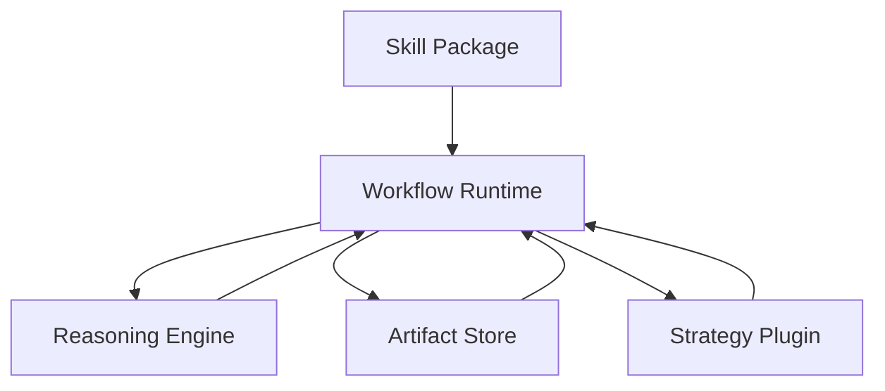

# Skill-Defined Workflow Runtime

This design note uses the same core terms as the root README:

- `support ticket workflow`
- `bug triage workflow`
- `minimal-transfer`
- `state-sufficient boundary`

## 1. Idea Overview

This repository currently implements two task-specific multi-stage workflows:

- support ticket workflow
- bug triage workflow

Each workflow already relies on the same deeper assumption:

1. the task has an explicit stage graph
2. each stage produces structured state
3. downstream stages do not need the full upstream history all the time
4. different transfer strategies can be chosen under latency and SLO constraints

The next step is to lift this idea into a more general runtime:

> Build a skill-defined workflow runtime on top of the reasoning engine that reads a skill-defined workflow contract, tracks the current stage explicitly, and chooses the best state-transfer strategy for that stage under the current budget.

The key shift is:

- not "teach the model to infer arbitrary workflows from natural language"
- but "let each skill declare a machine-readable workflow contract, then execute it with a shared runtime"

This is what makes the idea reusable rather than task-specific.

---

## 2. Problem Statement

For many realistic tasks, the expensive part is not only generation itself, but also repeated context transfer:

- long raw source packs
- repeated full-history carry
- duplicated evidence reading
- unnecessary re-reading in later reasoning stages

In practice, different stages need different amounts of prior state.

Examples:

- an evidence stage may need the original source pack
- a decision stage may only need a structured evidence summary
- a review stage may only need the decision plus a small set of checks

So the problem becomes:

> Given a known workflow, can we externalize intermediate state and route only minimal-transfer state into each later stage, while dynamically adapting to the remaining SLO budget?

---

## 3. Core Design Principle

The design rests on one principle:

> Structured transfer should be workflow-aware, not task-hardcoded and not prompt-guessed.

That means the runtime should not try to guess:

- what stage the model is "thinking about"
- what fields matter from raw prompt prose
- whether a downstream stage probably needs more or less context

Instead, the runtime should know explicitly:

- which stage is running
- what the stage can read
- what the stage must read
- which optional reads are available
- which fallback strategy is allowed if the budget is tight

This knowledge should come from the skill definition.

---

## 4. High-Level Architecture



### 4.1 Skill Package

Each skill provides:

- stage definitions
- output schemas
- artifact views
- dependency contracts
- compression settings
- optional planner-read candidates
- evaluation hooks

### 4.2 Workflow Runtime

The runtime is the orchestration layer that:

- reads the workflow contract from the skill
- advances the workflow stage by stage
- stores structured artifacts
- assembles stage context
- calls the reasoning engine
- records traces, tokens, and stage timings
- exposes the current stage and remaining budget to strategy logic

### 4.3 Reasoning Engine

The reasoning engine should stay narrow and low-level:

- `generate_json`
- `generate_text`
- token counting
- tool execution
- model backend configuration

It should not own business workflow logic.

### 4.4 Strategy Plugin

The strategy layer decides how a stage should be executed under the current budget.

It may choose among:

- `full_history_carry`
- `structured_fixed_deps`
- `compressed_history_carry`
- optional-read planner on or off
- stage skipping for optional stages
- smaller max token budgets
- reduced review depth

---

## 5. Why Skills Are the Right Abstraction

Skills are a good place to define workflows because they already represent reusable task behavior.

A skill can naturally own:

- task intent
- stage prompts
- stage schemas
- allowed tool usage
- stage transitions
- transfer contracts

This makes the system extensible:

- new task -> add a new skill package
- same runtime, same engine, same strategy plugin

Without this layer, every new task risks becoming a custom Python workflow again.

---

## 6. Skill Contract Model

The skill should expose a machine-readable workflow manifest.

Natural-language skill documentation is helpful for humans, but not sufficient for runtime control.

### 6.1 Example Manifest Shape

```yaml
skill_name: support_ticket
workflow:
  version: 1
  entry_stage: ticket_intake
  stages:
    - name: ticket_intake
      kind: initial
      output_schema: SupportIntakeState
      max_tokens: 320
    - name: policy_evidence
      kind: routed
      output_schema: SupportPolicyEvidenceState
      max_tokens: 560
    - name: eligibility_assessment
      kind: routed
      output_schema: SupportEligibilityState
      max_tokens: 360
    - name: resolution_plan
      kind: routed
      output_schema: SupportResolutionPlanState
      max_tokens: 360
    - name: response_draft
      kind: routed
      output_schema: SupportResponseDraftState
      max_tokens: 460

  dependencies:
    policy_evidence:
      required:
        - ticket_intake.full_json
        - source_pack.full_text
    eligibility_assessment:
      required:
        - ticket_intake.full_json
        - policy_evidence.full_json
    resolution_plan:
      required:
        - ticket_intake.full_json
        - policy_evidence.summary
        - eligibility_state.full_json
    response_draft:
      required:
        - ticket_intake.summary
        - eligibility_state.summary
        - resolution_plan.full_json

  compression:
    schema: SupportCompressedMemory
    min_history_tokens: 4000
    skip_before:
      - policy_evidence

  strategy:
    default_transfer_mode: structured_fixed_deps
    allow_planner: false
```

### 6.2 Minimal Required Fields

At minimum, a skill manifest should define:

- stage graph
- output schema per stage
- artifact types and views
- required dependencies
- optional dependencies
- compression policy
- stage-level execution defaults

---

## 7. Runtime Execution Model

Execution should look like this:

```text
load skill manifest
-> initialize artifact store
-> run initial stage
-> store structured artifact
-> for each downstream stage:
     - compute remaining SLO
     - expose current stage metadata
     - ask strategy plugin how to execute this stage
     - assemble selected context
     - run stage
     - store output artifact
-> finalize traces and metrics
```

### 7.1 Explicit Stage State

The runtime should always know:

- `workflow_name`
- `stage_name`
- `stage_index`
- `is_optional_stage`
- `remaining_slo_s`
- `history_tokens`
- `selected_context_tokens`
- `required_dependencies`
- `available_optional_reads`
- `artifacts_written_so_far`

This is much better than inferring stage implicitly from prompt text.

---

## 8. Artifact Store and Views

Structured transfer depends on explicit artifact externalization.

Each stage output should be turned into one or more views, for example:

```text
ticket_intake.full_json
ticket_intake.summary
ticket_intake.checks

policy_evidence.full_json
policy_evidence.summary

decision_state.full_json
decision_state.risks
```

The runtime should reason over views, not raw blobs.

This enables:

- narrow reads
- cheap summaries
- better optional-read planning
- stage-specific transfer policies

---

## 9. Strategy Plugin Design

This is the most important extension point.

The strategy plugin receives the current execution state and returns an execution decision.

### 9.1 Example Strategy Input

```python
{
  "workflow_name": "bug_triage",
  "stage_name": "fix_plan",
  "remaining_slo_s": 2.7,
  "history_tokens": 5100,
  "selected_context_tokens": 900,
  "required_dependency_count": 3,
  "optional_read_candidates": [...],
  "previous_stage_confidence": 0.61,
  "is_optional_stage": False
}
```

### 9.2 Example Strategy Output

```python
{
  "transfer_mode": "structured_fixed_deps",
  "use_planner": False,
  "compress_history": True,
  "max_tokens_override": 220,
  "skip_stage": False,
  "notes": ["Budget is tight; disable optional reads and shrink response budget."]
}
```

### 9.3 Why This Matters

Once the stage is explicit, the strategy can vary by:

- stage type
- remaining budget
- context size
- confidence
- task criticality

This turns the system from a static transfer experiment into a stage-aware routing system.

---

## 10. SLO-Aware Adaptation

The runtime should support stage-level policy degradation.

Example:

- ample budget:
  - use planner
  - allow optional reads
  - use larger generation budget
- medium budget:
  - disable planner
  - keep only required reads
  - prefer structured transfer
- low budget:
  - compress history
  - reduce max tokens
  - skip optional review or explanation stages

This is much stronger than choosing one global strategy for the whole workflow.

---

## 11. Recommended Policy Ladder

For a first implementation, use a rule-based plugin.

### 11.1 Rule-Based Version

```text
if stage is evidence-heavy:
    allow raw-source reads
elif remaining_slo is tight:
    prefer structured_fixed_deps
elif history is huge and stage is downstream:
    use compressed_history
if stage is optional and remaining_slo is very low:
    skip stage
```

This is stable, inspectable, and easy to debug.

### 11.2 Later Version

Later, the strategy plugin could use:

- stage statistics from prior runs
- learned latency predictors
- learned quality-risk predictors
- a policy model for transfer selection

But that is a later step. The first version should stay explicit.

---

## 12. Mapping to the Current Repository

The repository already contains most of the runtime primitives:

- shared transfer runtime:
  [structured_agent/transfer_methods/common.py](/Users/loren/Desktop/code/agent/structured_agent/structured_agent/transfer_methods/common.py)
- artifact store and shared metrics:
  [structured_agent/state_transfer.py](/Users/loren/Desktop/code/agent/structured_agent/structured_agent/state_transfer.py)
- task workflows:
  [structured_agent/support_ticket_workflow.py](/Users/loren/Desktop/code/agent/structured_agent/structured_agent/support_ticket_workflow.py)
  [structured_agent/bug_triage_workflow.py](/Users/loren/Desktop/code/agent/structured_agent/structured_agent/bug_triage_workflow.py)

So the current codebase is already close to this architecture.

What is still missing is mainly:

1. a first-class skill manifest format
2. a runtime that loads workflow definitions from skill metadata instead of hardcoded Python adapters
3. a strategy plugin interface for stage-aware routing

---

## 13. Proposed Refactor Path

### Phase 1: Freeze the Current Runtime Interface

Keep the current runtime primitives, but standardize the internal contract:

- stage definitions
- artifact builders
- dependency specs
- compression config

### Phase 2: Extract Workflow Definitions

Move workflow-specific definitions out of pure Python classes and into skill-owned metadata.

This can still be backed by Python schema objects, but the workflow graph itself should become declarative.

### Phase 3: Add a Strategy Plugin Interface

Introduce a strategy hook such as:

```python
select_stage_policy(stage_context) -> StagePolicyDecision
```

### Phase 4: Enable Skill-Declared Routing Policies

Allow skills to say:

- review is skippable
- planner is allowed only on certain stages
- compression should be skipped before certain heavy first stages
- full-source reads are restricted to certain stages

### Phase 5: Compare Static vs Dynamic Routing

Run experiments comparing:

- fixed transfer mode for the whole workflow
- stage-aware dynamic routing under the same SLO

---

## 14. Non-Goals

This idea should explicitly avoid several traps.

### 14.1 Not a Generic Agent-of-Anything Parser

The runtime should not attempt to infer arbitrary workflows from loose prompt text.

### 14.2 Not Chain-of-Thought Introspection

The strategy plugin should not depend on reading internal hidden reasoning.

### 14.3 Not Full Task Automation by Manifest Alone

Skills can declare the workflow contract, but prompt builders, schemas, tools, and evaluation hooks may still need task-specific code.

The goal is reusable orchestration, not zero-code tasks.

---

## 15. Main Risks

### 15.1 Manifest Drift

If prompts change but manifests do not, runtime behavior becomes invalid.

Mitigation:

- treat workflow metadata as first-class
- validate stage names, views, and schemas during skill load

### 15.2 Over-Declarative Workflow Design

Some tasks are not stable enough to fit a rigid stage graph.

Mitigation:

- start with workflows that are already naturally staged
- keep branching support modest at first

### 15.3 Strategy Explosion

Too many knobs can make experiments noisy.

Mitigation:

- begin with a small strategy space
- keep policies interpretable

---

## 16. Best Early Task Types

This architecture is especially well suited for:

- support ticket workflows
- bug triage workflows
- compliance or review workflows
- multi-stage analysis with a clear decision suffix

It is less suitable for:

- unconstrained open-ended exploration
- workflows with no stable stage graph
- highly improvisational tool use

---

## 17. Suggested First Implementation

The first practical version should include:

1. a minimal skill manifest format
2. a manifest loader
3. a `WorkflowRuntime` that consumes the manifest
4. a simple `StrategyPlugin` interface
5. one rule-based strategy plugin
6. migration of two current workflows:
   - support ticket workflow
   - bug triage workflow

That would be enough to validate the full idea end to end.

---

## 18. Summary

The idea is feasible and technically well aligned with the current repository direction.

The core insight is:

> make workflow structure explicit at the skill level, expose stage state explicitly at runtime, and let a strategy component choose how much state to transfer at each stage under SLO constraints.

This gives a path from:

- hand-authored task workflows

to:

- reusable skill-defined workflow execution

and then to:

- stage-aware dynamic routing for structured transfer.

That is a strong and coherent research direction because it connects:

- workflow structure
- state externalization
- transfer efficiency
- latency budgets
- dynamic policy selection

into one unified system design.
